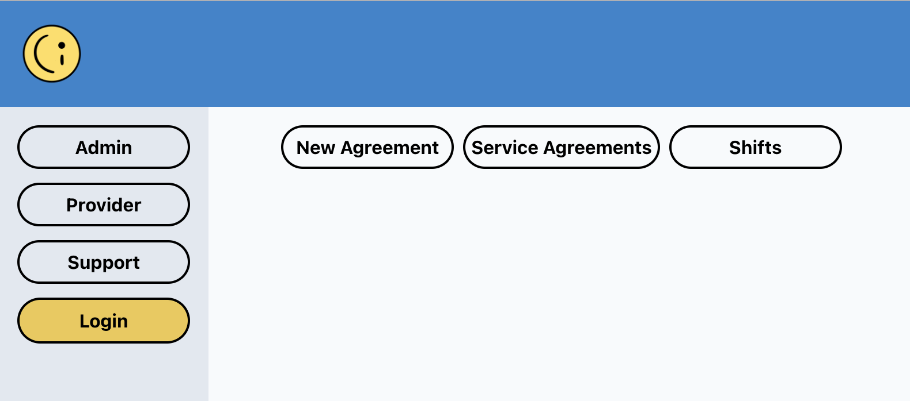

# Circle Independent

<<<<<<< HEAD
- [Link to Deployment](https://circleindependent.onrender.com/)

- [Presentation](/Circle%20Independent.pdf)
=======

>>>>>>> main

Circle Independent is an application developed for a small business called Circle Support. The application is the platform through which the business will be transitioning its support work and coordination staff to independent emloyment as sole trading businesses working in the provision of disability supports.

- Easy to Use
- Secure
- Role Based Interface
- Modern Reactive feel

## Libraries/frameworks

Circle Independent makes use of hte following technologies.

### Frontend

- [React](https://reactjs.org/) - main frontend library
- [React router](https://reactrouter.com/en/main) - for routing

#### Frontend UI

- [Chakra UI](https://v2.chakra-ui.com/) - for react components and styling of Interface

### Backend

- [Node JS](https://nodejs.org/en) - provides the server and overall back end capabilities
- [Mongoose JS](https://mongoosejs.com/) - elegant mongodb object modeling for node.js
- [Apollo Server](https://www.apollographql.com/docs/apollo-server/) - An open-source library for server-side GraphQL operation handling. It can be used as a monolithic GraphQL server or a subgraph server within a supergraph.
- [dotenv](https://www.npmjs.com/package/jsonwebtoken) - creation of token based authentication
- [dotenv](https://www.npmjs.com/package/dotenv) - to load your configs from an .env file

### Development

- [Vite](https://vitejs.dev/) - modern and fast build tool
- [Eslint](https://eslint.org/) - static code analysis for identifying problematic patterns found in your code

## Starting the app

- Clone the repository
- Copy `.env.example` and rename to `.env`
- Update `.env` variables
- Create a mongoDB database and update `.env` connection string
- In a production environment set up:
- `npm run install` - from the root directory to install dependencies for both server and client
- `npm run build` - from the root directory to build the client distribution folder
- `npm run start` - to start the server and begin serving the client distribution folder and back end serving.

## How it works

The react based client serves a simple page with a prominent submenu based on the role of the user. For example Admin, Provider, Customer.
The main feature of this deployment is the ability of a user to register(in testing they automatically become both a provider and a customer).
They are then able to prepare a service agreement for a customer.
That service agreement is then sent to the customer for viewing and signing.

The UI is deliberatly simple and focussed on buttons and selections rather than inputing details using a keyboard.

<<<<<<< HEAD
=======

## Questions

For questions, please contact <mailto:cawooda@gmail.com> or

view github:
(

)
<https://github.com/cawooda/>

## License

<https://choosealicense.com/licenses/MIT/>

MIT License

Copyright (c) [year] [fullname]

Permission is hereby granted, free of charge, to any person obtaining a copy
of this software and associated documentation files (the "Software"), to deal
in the Software without restriction, including without limitation the rights
to use, copy, modify, merge, publish, distribute, sublicense, and/or sell
copies of the Software, and to permit persons to whom the Software is
furnished to do so, subject to the following conditions:

The above copyright notice and this permission notice shall be included in all
copies or substantial portions of the Software.

THE SOFTWARE IS PROVIDED "AS IS", WITHOUT WARRANTY OF ANY KIND, EXPRESS OR
IMPLIED, INCLUDING BUT NOT LIMITED TO THE WARRANTIES OF MERCHANTABILITY,
FITNESS FOR A PARTICULAR PURPOSE AND NONINFRINGEMENT. IN NO EVENT SHALL THE
AUTHORS OR COPYRIGHT HOLDERS BE LIABLE FOR ANY CLAIM, DAMAGES OR OTHER
LIABILITY, WHETHER IN AN ACTION OF CONTRACT, TORT OR OTHERWISE, ARISING FROM,
OUT OF OR IN CONNECTION WITH THE SOFTWARE OR THE USE OR OTHER DEALINGS IN THE
SOFTWARE.;

---
>>>>>>> main
